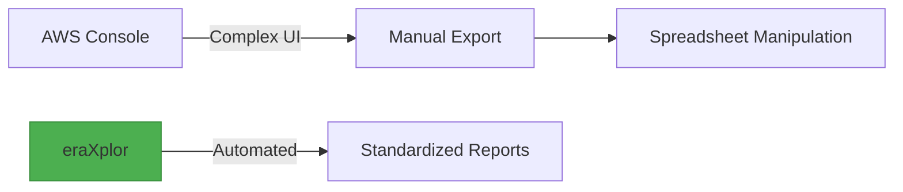

AWS Cost Export Tool for automated cost reporting and analysis.

**eraXplor** is an automated AWS cost reporting tool designed for assest DevOps and FinOps teams fetching and sorting AWS Cost Explorer.
it extracts detailed cost data by calling AWS Cost Explorer API directly and Transform result as a CSV.
`eraXplor` gives you the ability to sort the cost by Account or even By Service, as well as format and separate the result Monthly.

*`eraXplor` is still under enhancement and this is an 'Initial Model'*

## Key Features
- ✅ **Account-Level Cost Breakdown**: Monthly unblended costs per linked account.
- ✅ **Service-Level Cost Breakdown**: Monthly unblended costs per Services.
- ✅ **Flexible Date Ranges**: Custom start/end dates with validation.
- ✅ **Multi-Profile Support**: Works with all configured AWS profiles.
- ✅ **CSV Export**: Ready-to-analyze reports in CSV format.
- ✅ **Cross-platform CLI Interface**: Simple terminal-based workflow, and Cross OS platform.
- ✅ **Documentation Ready**: Well explained documentations assest you to kick start rapidly.
- ✅ **Open-Source**: the tool is open-source under Apache02 and GNU licenses, which enables your to enhance it for your purpose.

## Why eraXplor?

