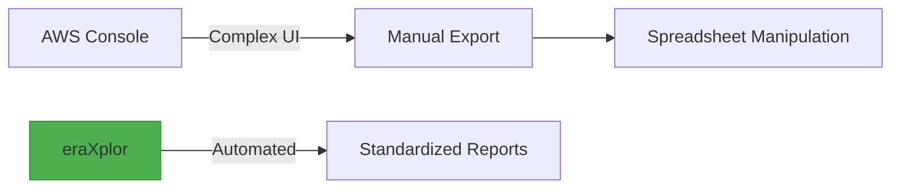

# Explanation

## Understanding AWS Cost Visibility Challenges

In ***big Architectural designs***, AWS Cloud Architects tend to segregate resources via ***multi AWS Accounts environment/Landing Zone environment.*** 

Manual Cost visibility, comparison, and Reconciliation, versus these multi accounts, become overwhelming as we go. based on how many accounts you have and months you attend to compare. 

Even in ***a tiny Architectural design***, Manual Comparing the ***current cost*** of all ***consumied Services*** agianest the ***months before***, become overwheming, based on the how many services you consiume and months you intend to compare.

## How eraXplor Addresses These Challenges

`eraXplor` is a CLI tool deliver an automatic way to aggregate cost data based on user inputs and export these data into CSV format.

- Aggregate cost data per AWS Accounts, Monthly or Daily.
- Aggregate cost data per AWS Services. Monthly or Daily.
- Aggregate cost data per AWS Purchase Type. Monthly or Daily.
- Aggregate cost data per AWS Usage Type. Monthly or Daily.
- Aggregate cost data per composite Account + Service + Purchase Type + Usage Type. Monthly or Daily.
- Export data in reports, CVS format.
- Suport AWS profile Credintials.
- Cross-platform CLI interface.

## Key Features

- **Account-Level Cost Breakdown**: Monthly or daily unblended costs per linked account.
- **Service-Level Cost Breakdown**: Monthly or daily unblended costs per Services.
- **Purchase Type-Level Cost Breakdown**: Monthly or daily unblended costs per Purchase Type.
- **Usage Type-Level Cost Breakdown**: Monthly or daily unblended costs per Usage Type.
- **Composite Cost Breakdown**: Monthly or daily unblended costs per composite Account.
- **Flexible Date Ranges**: Custom start/end dates with validation.
- **Multi-Profile Support**: Works with all configured AWS profiles.
- **CSV Export**: Ready-to-analyze reports in CSV format.
- **Cross-platform CLI Interface**: Simple terminal-based workflow, and **Cross OS** platform.
- **Documentation Ready**: Well explained documentations assest you kick start rapidly.
- **Open-Source**: the tool is open-source under Apache 2.0 license, which enables your to enhance it for your purpose.

## Why eraXplor?

