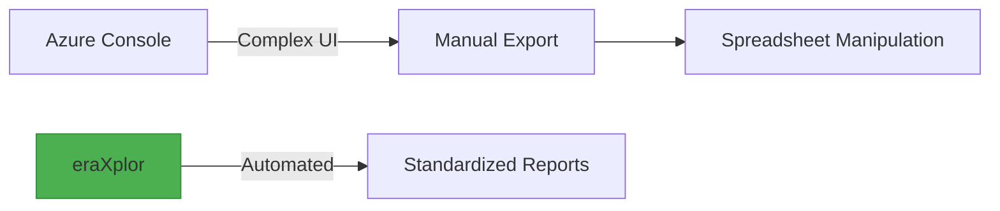

# Explanation

## Understanding Azure Cost Visibility Challenges

In ***big Architectural designs***, Azure Cloud Architects tend to segregate resources via ***multi Azure subscription environments.*** 

Manual Cost visibility, comparison, and Reconciliation, versus these multi subscription, become overwhelming as we go. based on how many subscriptions you have and months you attend to compare. 

Even in ***a tiny Architectural design***, Manual Comparing the ***current cost*** of all ***consumied Services*** agianest the ***months before***, become overwheming, based on the how many services you consiume and months you intend to compare.

## How eraXplor Addresses These Challenges

`eraXplor-azure` is a CLI tool deliver an automatic way to aggregate cost data based on user inputs and export these data into CSV format.

### Cost Grouping Dimensions

eraXplor-azure provides three powerful grouping dimensions for cost analysis:

| Dimension | Description | Use Case |
|-----------|-------------|----------|
| **Subscription** | Group costs by Azure subscription | Multi-subscription cost allocation and chargebacks |
| **ServiceName** | Group costs by Azure service type | Identify cost drivers (VMs, Storage, SQL, etc.) |
| **ResourceGroupName** | Group costs by Resource Group | FinOps tagging compliance and team-based costing |

### Key Capabilities

- Aggregate cost data per Azure Subscription, Service, or Resource Group
- Monthly or Daily cost aggregation
- CSV export with currency and tags metadata
- Support for Azure CLI credentials and Managed Identity
- Cross-platform CLI interface

## Key Features

- **Subscription-Level Cost Breakdown**: Detailed breakdown of costs by Azure subscription with tags support.
- **Service-Level Cost Breakdown**: Group costs by Azure service name e.g. Virtual Machines, Storage, SQL Database.
- **Resource Group Cost Breakdown**: Group costs by Azure Resource Group for FinOps tagging strategies.
- **Multi-Subscription Support**: Automatically detects and queries all accessible Azure subscriptions.
- **Daily/Monthly Cost Breakdown**: View costs aggregated by day or month based on your reporting needs.
- **Flexible Date Ranges**: Custom start/end dates with validation.
- **Secure Authentication**: Uses Azure DefaultAzureCredential (supports Azure CLI, Managed Identity, Service Principal).
- **CSV Export**: Ready-to-analyze reports in CSV format with currency and tags.

## Why eraXplor?

