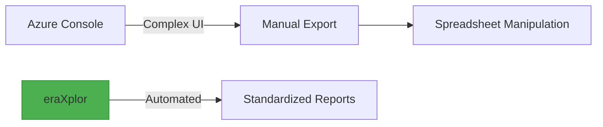

# Explanation

## Understanding Azure Cost Visibility Challenges

In ***big Architectural designs***, Azure Cloud Architects tend to segregate resources via ***multi Azure subscription environments.*** 

Manual Cost visibility, comparison, and Reconciliation, versus these multi subscription, become overwhelming as we go. based on how many subscriptions you have and months you attend to compare. 

Even in ***a tiny Architectural design***, Manual Comparing the ***current cost*** of all ***consumied Services*** agianest the ***months before***, become overwheming, based on the how many services you consiume and months you intend to compare.

## How eraXplor Addresses These Challenges

`eraXplor-azure` is a CLI tool deliver an automatic way to aggregate cost data based on user inputs and export these data into CSV format.

- Aggregate cost data per Azure Subscription, Monthly or Daily.
- Export data in reports, CVS format.
- Suport Azure CLI credintials.
- Cross-platform CLI interface.

## Key Features

- ✅ **subscription-Level Cost Breakdown** : eraXplor provides a detailed breakdown of costs by subscription, allowing you to identify areas where costs.
- ✅ **Daily/Monthly Cost Breakdown** : eraXplor allows you to view costs on a daily or monthly basis, giving you a clear.
- ✅ **Flexible Date Ranges**: Custom start/end dates with validation.
- ✅ **Support secure authentication**: By fetching Azure credentials configured within terminal.
- ✅ **CSV Export**: Ready-to-analyze reports in CSV format.
- ✅ **Cross-platform CLI Interface**: Simple terminal-based workflow, and **Cross OS** platform.
- ✅ **Documentation Ready**: Well explained documentations assest you kick start rapidly.
- ✅ **Open-Source**: the tool is open-source under Apache 2.0 license, which enables your to enhance it for your purpose.

## Why eraXplor?

