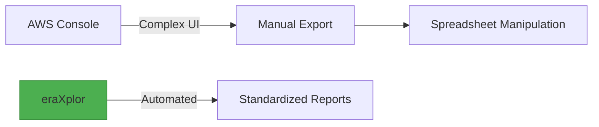

# Explanation

## Understanding AWS Cost Visibility Challenges

In ***big Architectural designs***, AWS Cloud Architects tend to segregate resources via ***multi AWS Accounts environment/Landing Zone environment.*** 

Manual Cost visibility, comparison, and Reconciliation, versus these multi accounts, become overwhelming as we go. based on how many accounts you have and months you wanna compare. 

Even in ***a tiny Architectural design***, Manual Comparing the ***current cost*** of all ***consumied Services*** agianest the ***months before***, become overwheming, based on the how many services you consiume and months you intend to compare.

## How eraXplor Addresses These Challenges
`eraXplor` is a CLI tool deliver an automatic way to aggregate cost data based on user inputs and export these data into CSV format.

- Aggregate cost data per AWS Accounts.
- Aggregate cost data per AWS Services.
- Export data in reports, CVS format. 
- Suport AWS profile Credintials.
- Cross-platform CLI interface.

## Key Features
- ✅ **Account-Level Cost Breakdown**: Monthly unblended costs per linked account.
- ✅ **Service-Level Cost Breakdown**: Monthly unblended costs per Services.
- ✅ **Flexible Date Ranges**: Custom start/end dates with validation.
- ✅ **Multi-Profile Support**: Works with all configured AWS profiles.
- ✅ **CSV Export**: Ready-to-analyze reports in CSV format.
- ✅ **Cross-platform CLI Interface**: Simple terminal-based workflow, and Cross OS plateform.
- ✅ **Documentation Ready**: Well explained documentations assest you kick start rapidly.
- ✅ **Open-Source**: the tool is open-source under Apache02 and GNU licenses, which enables your to enhance it for your purpose.

## Why eraXplor?

<!-- This part of the project documentation focuses on an
**understanding-oriented** approach. You'll get a
chance to read about the background of the project,
as well as reasoning about how it was implemented.

> **Note:** Expand this section by considering the
> following points:

- Give context and background on your library
- Explain why you created it
- Provide multiple examples and approaches of how
    to work with it
- Help the reader make connections
- Avoid writing instructions or technical descriptions
    here -->