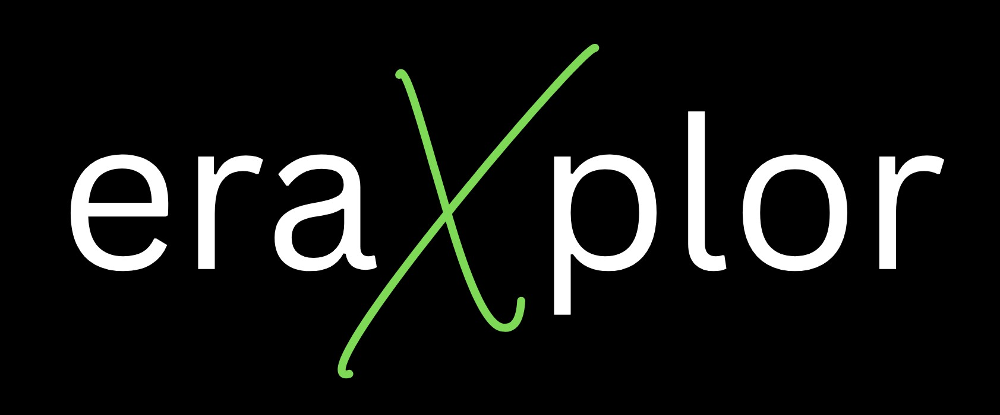
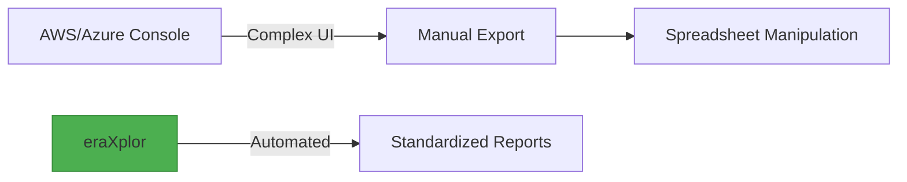

# Welcome to eraXplor

Cost Export Tool for automated cost reporting and analysis.

**eraXplor** is an automated cost reporting tool designed for assist DevOps and FinOps teams fetching and sorting AWS and Azure Cost Explorer.
it extracts detailed cost data by calling nativly cloud provider APIs directly and Transform result into CSV file.
`eraXplor` gives you the ability to sort the cost with wide range of options:

- For **AWS** you able to sort cost by Account, Service, Usage Type or even By Purchase Type; as well as format and separate the result by Monthly or Daily.
- For **Azure** you able to sort cost by Subscription, as well as format and separate the result by Monthly or Daily.
 

## Key Features

- **Cloud provider Separated tools**: Separated tool for each cloud provider (AWS and Azure) avoiding complexty.
- **Flexible Date Ranges**: Custom start/end dates with validation.
- **Multi-Profile Support**: Works with all configured AWS profiles.
- **Multi-Subscription Support**: Works to list all configured Azure subscriptions.
- **CSV Export**: Ready-to-analyze reports in CSV format.
- **Cross-platform CLI Interface**: Simple terminal-based workflow, and **Cross OS** platform.
- **Documentation Ready**: Well explained documentations assist you kick start rapidly.
- **Open-Source**: the tool is open-source under Apache 2.0 license, which enables your to enhance it for your purpose.

## Why eraXplor?

```mermaid
graph LR
    A[AWS/Azure Console] -->|Complex UI| B[Manual Export]
    B --> C[Spreadsheet Manipulation]
    D[eraXplor] -->|Automated| E[Standardized Reports]
    style D fill:#4CAF50,stroke:#388E3C
```

## Table Of Contents

Quickly find what you're looking for depending on
your use case by looking at the different pages.

### AWS

1. [Overview](aws/index.md)
2. [Tutorials](aws/tutorials.md)
3. [How-To Guides](aws/how-to-guides.md)
5. [Concepts & Explanation](aws/explanation.md)

### Azure

1. [Overview](azure/index.md)
2. [Tutorials](azure/tutorials.md)
3. [How-To Guides](azure/how-to-guides.md)
5. [Concepts & Explanation](azure/explanation.md)

---

- [Reference](reference.md)

## About the Author

???+ info "Show/Hide Author Details"

    **Mohamed eraki**  
    *Cloud & DevOps Consultant*

      
       
    

    ### Project Philosophy

    > "I built eraXplor to solve real-world cloud cost visibility challenges — the same pain points I encounter daily in enterprise environments. This tool embodies my belief that financial accountability should be accessible to every technical team."
<!-- [Get Started](#){ .md-button } -->

<!-- This site contains the project documentation for the
`calculator` project that is a toy module used in the
Real Python tutorial
[Build Your Python Project Documentation With MkDocs](
    https://realpython.com/python-project-documentation-with-mkdocs/).
Its aim is to give you a framework to build your
project documentation using Python, MkDocs,
mkdocstrings, and the Material for MkDocs theme.

## Table Of Contents

The documentation follows the best practice for
project documentation as described by Daniele Procida
in the [Diátaxis documentation framework](https://diataxis.fr/)
and consists of four separate parts:

1. [Tutorials](tutorials.md)
2. [How-To Guides](how-to-guides.md)
3. [Reference](reference.md)
4. [Explanation](explanation.md)

Quickly find what you're looking for depending on
your use case by looking at the different pages.

## Project Overview

::: main

## Acknowledgements

I want to thank my house plants for providing me with
a negligible amount of oxygen each day. Also, I want
to thank the sun for providing more than half of their
nourishment free of charge. -->