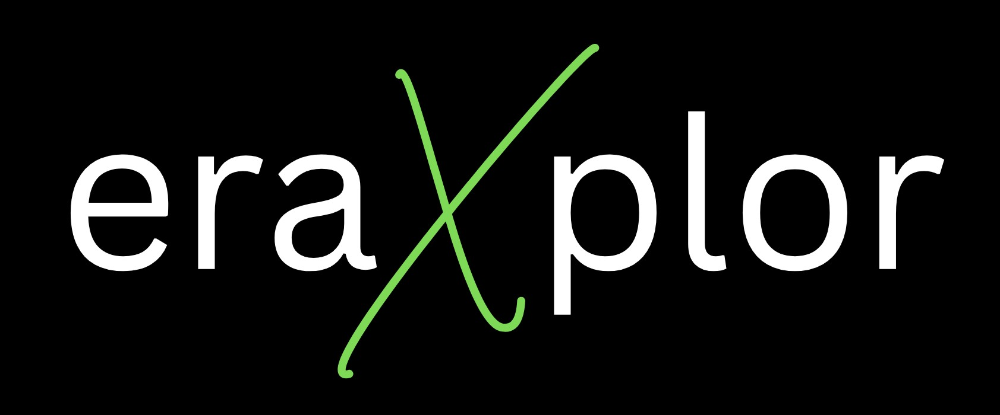

# Welcome to eraXplor



AWS Cost Export Tool for automated cost reporting and analysis.

**eraXplor** is an automated AWS cost reporting tool designed for assest DevOps and FinOps teams fetching and sorting AWS Cost Explorer.
it extracts detailed cost data by calling AWS Cost Explorer API directly and Transform result as a CSV.
`eraXplor` gives you the ability to sort the cost by Account or even By Service, as well as format and separate the result Monthly.

*`eraXplor` is still under enhancement and this is an 'Initial Model'*


## Key Features
- ✅ **Account-Level Cost Breakdown**: Monthly unblended costs per linked account.
- ✅ **Service-Level Cost Breakdown**: Monthly unblended costs per Services.
- ✅ **Flexible Date Ranges**: Custom start/end dates with validation.
- ✅ **Multi-Profile Support**: Works with all configured AWS profiles.
- ✅ **CSV Export**: Ready-to-analyze reports in spreadsheet format.
- ✅ **Cross-platform CLI Interface**: Simple terminal-based workflow, and Cross OS plateform.
- ✅ **Documentation Ready**: Well explained documentations assest you kick start rapidly.
- ✅ **Open-Source**: the tool is open-source under Apache02 and GNU licenses, which enables your to enhance it for your purpose.

## Why eraXplor?
```mermaid
graph LR
    A[AWS Console] -->|Complex UI| B[Manual Export]
    B --> C[Spreadsheet Manipulation]
    D[eraXplor] -->|Automated| E[Standardized Reports]
    style D fill:#4CAF50,stroke:#388E3C


## Table Of Contents
Quickly find what you're looking for depending on
your use case by looking at the different pages.

1. [Tutorials](tutorials.md)
2. [How-To Guides](how-to-guides.md)
3. [Reference](reference.md)
4. [Explanation](explanation.md)


## About the Author

???+ info "Show/Hide Author Details"

    **Mohamed eraki**  
    *Cloud & DevOps Engineer*

    Cloud and DevOps engineer with a total of 5 years experience in technologies. With 2 years of experience in Cloud and DevOps, specializing in implementing and optimizing cloud-based *'Fin-Tech'* solutions, and 3 years of experience focused on on-prem *'Fin-Tech'* solutions.

    [](mailto:mohamed-ibrahim2021@outlook.com)  
    [](https://www.linkedin.com/in/mohamed-el-eraki-8bb5111aa/)  
    [](https://x.com/__eraki__)  
    [](https://eraki.hashnode.dev/)

    ### Project Philosophy

    > "I built eraXplor to solve real-world cloud cost visibility challenges — the same pain points I encounter daily in enterprise environments. This tool embodies my belief that financial accountability should be accessible to every technical team."

    ### Acknowledgments

    Special thanks to the open source community for:
    - [RealPython](https://realpython.com/)
    - [boto3](https://boto3.amazonaws.com) - AWS SDK for Python
    - [mkdocs-material](https://squidfunk.github.io/mkdocs-material/) - Documentation framework


<!-- [Get Started](#){ .md-button } -->

<!-- This site contains the project documentation for the
`calculator` project that is a toy module used in the
Real Python tutorial
[Build Your Python Project Documentation With MkDocs](
    https://realpython.com/python-project-documentation-with-mkdocs/).
Its aim is to give you a framework to build your
project documentation using Python, MkDocs,
mkdocstrings, and the Material for MkDocs theme.

## Table Of Contents

The documentation follows the best practice for
project documentation as described by Daniele Procida
in the [Diátaxis documentation framework](https://diataxis.fr/)
and consists of four separate parts:

1. [Tutorials](tutorials.md)
2. [How-To Guides](how-to-guides.md)
3. [Reference](reference.md)
4. [Explanation](explanation.md)

Quickly find what you're looking for depending on
your use case by looking at the different pages.

## Project Overview

::: main

## Acknowledgements

I want to thank my house plants for providing me with
a negligible amount of oxygen each day. Also, I want
to thank the sun for providing more than half of their
nourishment free of charge. -->